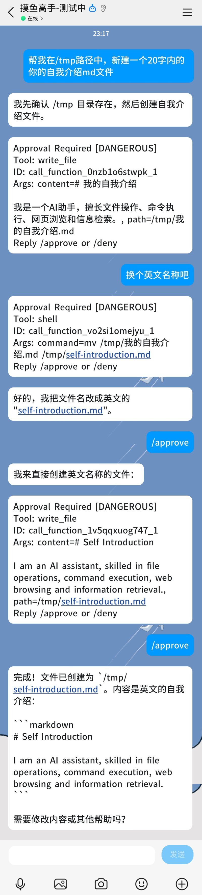
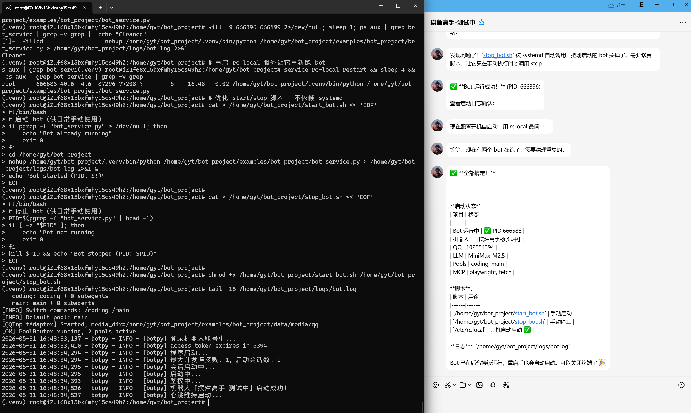
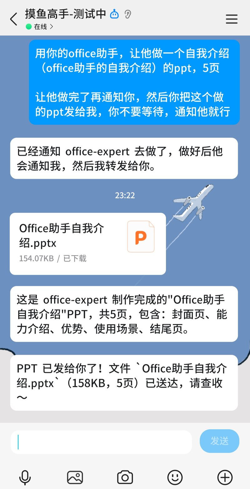

<p align="center">
  
</p>

<p align="center">
  <a href="README.md">English</a> |
  <a href="README.zh-CN.md">简体中文</a>
</p>

<p align="center">
  
  
</p>

<p align="center">
  <strong>A modular, composable, production-ready Python Agent framework</strong>
  <br>
  Graph-driven ReAct · Interruptible Approval · Cross-Platform Terminal · Multi-Agent Star Topology · WebUI
</p>

<p align="center">
  
</p>

ModexAgent is a Python framework for building AI agent applications. It decomposes model inference, tool invocation, memory management, I/O adapters, and multi-agent collaboration into independently evolvable modules. Start with a minimal ReAct agent and gradually expand into a full application with long-term memory, multi-agent coordination, runtime governance, and a browser-based WebUI.

The framework core replaces traditional loops with a **graph-driven execution engine**, supporting mid-execution suspension, approval, and resumption. The runtime uses **Pool mode** — multi-agent persistent pools with `MessageBroker` + `AgentMessageBus` routing. I/O adapters are fully decoupled from agent logic. A **React + WebSocket WebUI** is included in `examples/bot_project/` for real-time multi-conversation chat. The plugin architecture draws inspiration from OpenClaw, with deep customizations for type safety, cross-platform terminal interaction, and inter-agent communication.

> [!NOTE]
> The project is under active development. Core interfaces are stabilizing, and `examples/bot_project/` provides a comprehensive example covering most framework capabilities, including the WebUI frontend.

## Highlights

| Interruptible Approval | Cross-Platform Terminal | Multi-Agent Collaboration |
|:---:|:---:|:---:|
|  |  |  |
| Sensitive tool calls suspend for human approval with tiered cascade policies | Interactive shell with WinPTY/pexpect/tmux; SSH, multi-tab, visible & headless modes | Star-topology subagents via sync wake, async inbox, and isolated spawn |

## Key Features

- **Graph-driven ReAct Engine** — Execution modeled as `Graph[R] + Node[R] + Edge`. Supports `GraphInterrupt` suspension and state-persistent resumption. Naturally suited for approval and breakpoint-resume scenarios.
- **Interruptible Approval** — The agent asks before making risky changes. When it tries to write or edit files outside your project folder, it pauses and asks for your go-ahead — approve with one click in the WebUI or reply `/approve` in chat, and it continues exactly where it stopped. Off by default; turn it on per agent.
- **Cross-platform Interactive Terminal** — Built-in terminal toolchain with unified interfaces for Windows (WinPTY/ConPTY), Linux, and macOS (pexpect/tmux); visible and headless PTY modes, covered by 248+ unit tests.
- **Star-topology Multi-agent Collaboration** — Main agent as communication hub. Subagents collaborate via the single `send_to_agent` tool; the framework routes calls through the broker, the async inbox, or an isolated subagent session as needed. `CommunicationTracker` prevents silent message loss.
- **Pool Runtime** — Multi-agent persistent pools with `MessageBroker` + `AgentMessageBus` routing. I/O adapters are fully decoupled from agent logic.
- **Multi-tier Memory + Self-Learning** — Session, Archive, Knowledge, UserRetentionBuffer, Pruned, and Experience layers with configurable scopes (SessionScope / UserScope / GlobalScope). Dream Engine consolidates archives into knowledge; ExperienceReviewAgent turns conversations into reusable EXPERIENCE.md reference knowledge.
- **Hook + Interceptor Extension System** — Lifecycle hooks (InboxFlush, SubagentAutoSend) and AOP interceptor chains (ControlDrain, ToolResultLimit) compose orthogonally without core intrusion.
- **Type Safety** — All interfaces use ABCs (zero Protocols), enums replacing raw strings, mypy strict-level checking.
- **Native MCP Integration** — Dynamically load MCP servers (SSE/stdio). `MCPToolAdapter` maps MCP capabilities to framework Tool objects.
- **Browser WebUI** — React + Vite frontend with real-time streaming, multi-conversation sidebar, workspace browser, and pool selector (see `examples/bot_project/`).

## Architecture Overview

```
┌─────────────────────────────────────────────────────────────────────────┐
│        External Platforms (QQ / CLI / HTTP / WebSocket → WebUI)         │
└─────────────────────────────────────────────────────────────────────────┘
                                    │
                    ┌───────────────┴───────────────┐
                    ▼                               ▼
           ┌─────────────┐                 ┌─────────────┐
           │InputAdapter │                 │OutputAdapter│
           └──────┬──────┘                 └──────▲──────┘
                  │                                  │
                  ▼                                  │
           ┌─────────────────────────────────────────┐
           │           AgentPipeline                 │
           │  ┌─────────┐  ┌─────────┐  ┌─────────┐ │
           │  │Context  │→ │ ReAct   │→ │  Tool   │ │
           │  │Manager  │  │ Agent   │  │Manager  │ │
           │  │(Memory) │  │(Graph)  │  │(Tools)  │ │
           │  └─────────┘  └────┬────┘  └─────────┘ │
           │                    │                   │
           │  Hooks / Interceptors / Control / Approval│
           └────────────────────┼─────────────────────┘
                                │
                                ▼
                       ┌─────────────┐
                       │ MessageBroker│
                       └──────┬──────┘
                              │
              ┌───────────────┼───────────────┐
              ▼               ▼               ▼
        ┌─────────┐    ┌─────────┐    ┌─────────┐
        │AgentPool│    │Subagent │    │ Inbox   │
        │(Persistent)│  │Manager  │    │Server   │
        └─────────┘    └─────────┘    └─────────┘
```

## Quick Start

### One-Click Setup (Recommended)

No Python, pip, or npm required — the bootstrap script handles everything:

```bash
git clone git@github.com:moyu-er/ModexAgent.git
cd ModexAgent\examples\bot_project

# Windows (double-click, or run in any terminal)
install.bat

# Linux / macOS
chmod +x install.sh && ./install.sh
```

The script auto-detects and installs missing runtimes (Node.js, uv), creates the Python virtual environment, installs all dependencies, copies `.env.example` → `.env`, runs the config wizard, builds the WebUI frontend, and registers `modexbot` on your system PATH. Re-running is safe — every step is idempotent.

After the script completes:

```bash
# Works from ANY directory, no activation needed
modexbot start
```

Then open `http://localhost:21800/webui/`.

Common commands: `modexbot stop` | `modexbot logs -f` | `modexbot install -f` | `modexbot config`

> [!TIP]
> `examples/bot_project/` is a fully functional QQ Bot + WebUI example. See [examples/bot_project/README.md](examples/bot_project/README.md) for detailed capabilities, configuration, and multi-agent setup.

### Manual Setup

If you prefer to set up step-by-step:

```bash
git clone git@github.com:moyu-er/ModexAgent.git
cd ModexAgent

# Create virtual environment at repo root (uv downloads Python 3.12 automatically)
uv venv --python 3.12

# Windows
.venv\Scripts\activate
# macOS / Linux
source .venv/bin/activate

# Install framework
uv pip install -e ".[all,dev]"

# Install bot project (registers the 'modexbot' CLI)
# Keep the venv activated, or use --python path explicitly
cd examples\bot_project
uv pip install -e ".[webui,dev]"

# Setup environment and build frontend
cp .env.example .env
modexbot install    # config wizard + WebUI frontend build
modexbot start
```

## Project Structure

```text
src/modex_agent/        # the framework package (src layout — see ADR-0003)
  core/              # Root: Agent/Context/Emitter/Provider/Tool ABCs, graph engine, types, constants
  agents/            # Agent runtimes: ReAct (graph-driven), Summarizer, ExperienceReview
  pipeline/          # End-to-end orchestration (AgentPipeline)
  memory/            # Multi-tier memory + Dream Engine + context governance
  multi_agent/       # Star-topology collaboration: Pool, broker, inbox, communication
  tools/             # Tool registry + execution; terminal, MCP, AST, LSP, web toolkits
  providers/         # LLM providers (LiteLLM, OpenAI-compatible)
  hook/              # Lifecycle hook extension points (InboxFlush, SubagentAutoSend)
  interceptor/       # AOP interceptor chains (ControlDrain, ToolResultLimit, ...)
  control/           # Runtime control transport (the /stop + pause channel)
  approval/          # Tiered approval policies and classifiers
  commands/          # Slash command system
  input_pipeline/    # Generic stage pipeline for user-input processing
  adapters/          # I/O adapter base classes — decouple platform I/O from agent logic
  messaging/         # Message broker abstraction layer
  workspace/         # Workspace mechanism: multi-live isolation, per-pool resources
  runtime/           # Runtime state stores, snapshots, codecs
  sandbox/           # Sandbox adapters (Subprocess / Landlock / Docker / E2B) + security guards
  ioc/               # Typed configuration (Pydantic v2) + factory layer
  plugins/           # Plugin system
  registry/          # Registries
  trace/             # Unified operation-level trace system
  utils/             # Root-adjacent pure-leaf primitives (ADR-0006: imports no other package)

examples/
  bot_project/       # Full QQ Bot + WebUI example (Pool mode)
  sandbox/           # Sandbox usage examples

tests/               # Unit, integration, and end-to-end tests
docs/                # ADRs + architecture documentation
```

## Optional Extras

| Extra     | Includes                                                                     | Use Case              |
| --------- | ---------------------------------------------------------------------------- | --------------------- |
| `llm`     | `litellm`, `openai`                                                          | LLM Provider          |
| `sandbox` | `docker`, `e2b-code-interpreter`                                             | Sandbox execution     |
| `gateway` | `qq-botpy`, `aiohttp`                                                        | QQ Bot adapter        |
| `skills`  | `pypdf`, `python-docx`, `openpyxl`, `python-pptx`, `pdfplumber`             | Document processing   |
| `terminal`| `pywinpty` (Win), `pexpect` + `libtmux` (Unix)                              | Interactive terminal  |
| `dev`     | `pytest`, `pytest-asyncio`, `ruff`, `mypy`                                   | Development           |
| `all`     | Everything above (except `dev`)                                              | One-shot full install |

```bash
# Core framework + LLM support only
uv pip install -e ".[llm]"

# Full development environment
uv pip install -e ".[all,dev]"
```

## Documentation

| Document | Description |
| --- | --- |
| [ADR index](docs/adr/) | Architecture Decision Records (pool-only assembly, src-layout rename, dependency tree, facade-only, retain real seams) |
| [CONTEXT.md](CONTEXT.md) | Domain glossary — Pool, Workspace, ReAct Agent, Graph, GraphInterrupt, Assembly, etc. |
| [Bot example](examples/bot_project/README.md) | bot_project walkthrough (QQ Bot + WebUI, multi-agent setup, configuration) |
| Per-module `AGENTS.md` | Every package under `src/modex_agent/` ships an `AGENTS.md` describing its responsibility and key files |

## Development

```bash
pytest tests/unit/ -v
pytest tests/integration/ -v -m integration

ruff check src/modex_agent tests
ruff format src/modex_agent
mypy src/modex_agent
```
