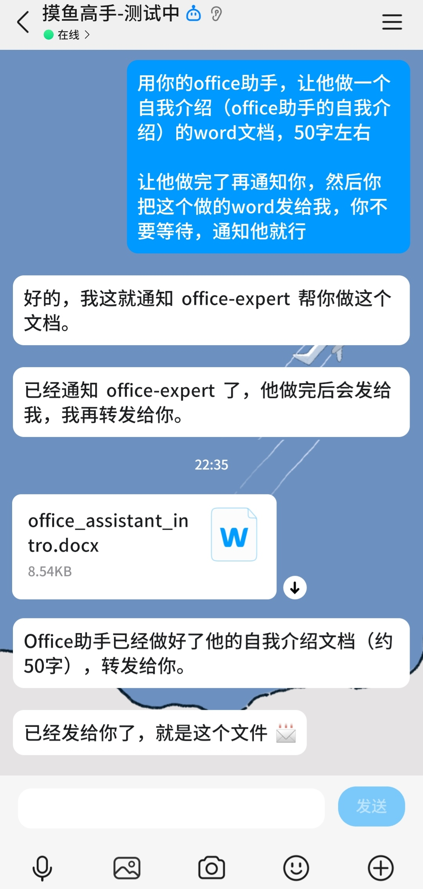

# ModexAgent

**ModexAgent** — **Mod**ular + N**ex**us + **Agent**，一个以模块化为核心设计理念的轻量级多 Agent 框架。

> **Modex** = **Mod**ular（模块化）+ **Nex**us（枢纽/连接点）。每个组件（记忆、工具、Agent、适配器、插件）都是独立的积木模块，通过清晰的接口协议连接组合，像拼装积木一样构建你需要的 Agent 系统。

## 为什么叫 ModexAgent？

| 词根 | 含义 | 映射到框架 |
|------|------|-----------|
| **Mod** | Modular — 模块化、可插拔 | Memory、Tool、Agent、Emitter、Adapter 均可独立替换 |
| **Nex** | Nexus — 枢纽、连接点 | AgentPipeline 作为编排枢纽，将所有模块组装在一起 |
| **Agent** | 智能体 | 框架的核心：ReAct Agent、Subagent、Peer Agent |

**设计哲学**：不造轮子，只做连接。ModexAgent 把 Agent 开发中需要的每个环节拆成独立模块，开发者按需取用、自由组合。

## 核心特性

- **🧩 积木式架构** — Memory / Tool / Agent / Emitter / Adapter 全部可插拔替换，按需组合
- **🧠 四层记忆系统** — Working → Short-term → History → Long-term，每层独立配置存储后端和压缩策略
- **🤖 多 Agent 协作** — SubagentManager（临时派生）+ AgentPool（常驻 Peer），支持跨 Agent 消息路由
- **🔧 工具生态** — 内置工具注册表、并行执行调度、MCP 协议客户端集成
- **📦 插件系统** — 基于约定的插件发现机制，支持注入 MemoryProvider、Hook 和工具
- **🔌 多平台接入** — 通过 Adapter 机制对接 QQ Bot、CLI、HTTP API 等任意平台
- **🔒 安全沙箱** — 支持 Subprocess / Landlock / Docker / E2B 多种隔离适配器
- **⚡ 流式支持** — StreamingAwareEmitter 统一处理流式与非流式输出

## 架构概览

```
┌──────────────────────────────────────────────────────────┐
│                     AgentPipeline                        │
│                   （编排枢纽 / Nexus）                     │
├──────────┬──────────┬──────────┬────────────────────────┤
│  Input   │  Agent   │  Tool    │      Output            │
│  Adapter │ (ReAct)  │ Manager  │      Adapter           │
├──────────┼──────────┼──────────┼────────────────────────┤
│          │          │          │                        │
│  ┌──────┴──────┐   │          │                        │
│  │   Memory    │   │          │                        │
│  │   System    │   │          │                        │
│  │ (四层记忆)   │   │          │                        │
│  └─────────────┘   │          │                        │
│                    │          │                        │
│  ┌─────────────┐   │          │   ┌────────────────┐  │
│  │  Emitter    │◀──┘          │   │  Plugin        │  │
│  │ (事件分发)   │              │   │  System        │  │
│  └─────────────┘              │   │ (MemoryProvider)│  │
│                               │   └────────────────┘  │
├───────────────────────────────┴────────────────────────┤
│                   Multi-Agent Layer                     │
│  ┌───────────────┐  ┌───────────┐  ┌───────────────┐  │
│  │ SubagentMgr   │  │ AgentPool │  │ MessageBroker │  │
│  │ (临时派生)     │  │ (常驻Peer) │  │ (消息路由)     │  │
│  └───────────────┘  └───────────┘  └───────────────┘  │
└────────────────────────────────────────────────────────┘
```

## 快速开始

### 环境要求

- Python >= 3.11
- [uv](https://docs.astral.sh/uv/) 包管理器（推荐）

### 1. 安装

```bash
# 安装 uv（如果还没有）
# Windows (PowerShell):
powershell -ExecutionPolicy ByPass -c "irm https://astral.sh/uv/install.ps1 | iex"
# macOS / Linux:
# curl -LsSf https://astral.sh/uv/install.sh | sh

# 克隆项目
git clone git@github.com:moyu-er/ModexAgent.git
cd ModexAgent

# 创建虚拟环境并安装依赖
uv venv
# Windows:
.venv\Scripts\activate
# macOS/Linux:
# source .venv/bin/activate

# 安装全部依赖
uv pip install -e ".[all]"
```

### 2. 配置

```bash
cd examples/bot_project
cp .env.example .env
```

编辑 `.env`，填入必要的配置：

```bash
# LLM — 兼容任意 OpenAI 格式 API
LLM_API_KEY=your_api_key
LLM_BASE_URL=https://api.minimaxi.com/v1
LLM_MODEL=openai/MiniMax-M2.5

# QQ Bot（如需接入 QQ 平台）
QQ_APP_ID=your_app_id
QQ_SECRET=your_secret
```

### 3. 启动

```bash
cd examples/bot_project

# Pool 模式（多 Agent 常驻协作）
python bot_service.py --mode pool
```

所有运行时配置集中在 `config/bot_config.yml`，通过 `${ENV_VAR}` 语法从 `.env` 读取密钥，无需改代码即可切换 LLM 供应商。

#### 使用截图



## 文档

| 文档 | 说明 |
|------|------|
| [架构概览](docs/architecture.md) | 整体架构设计、组件关系、数据流 |
| [核心模块](docs/core-modules.md) | Agent、Emitter、ToolManager、ContextManager 详解 |
| [记忆系统](docs/memory-system.md) | 四层记忆架构、Scope 体系、压缩策略 |
| [多 Agent 协作](docs/multi-agent-guide.md) | SubagentManager、AgentPool、Inbox 系统 |
| [扩展开发](docs/extension-guide.md) | 添加工具、Agent、插件、适配器 |
| [Bot 示例](docs/bot-guide.md) | QQ Bot 示例项目完整指南 |

## 项目结构

```
framework/
├── core/                  # 基础抽象：Agent, ContextManager, Emitter, Tool, Skills
├── agents/react/          # ReActAgent 实现
├── pipeline/              # AgentPipeline 编排、InputAdapter、OutputAdapter
├── session/               # AgentSession（请求/响应模式）
├── memory/                # 四层记忆系统
│   ├── core/              # 抽象基类：MemoryScope, Storage, Compression
│   ├── managers/          # Working, ShortTerm, History, LongTerm 管理器
│   ├── compression/       # 压缩策略：ToolChain, Importance, TokenWindow, Hybrid
│   ├── consolidation/     # Consolidator + DreamEngine
│   └── injection/         # 记忆注入策略
├── multi_agent/           # 多 Agent 协作
│   └── inbox/             # Inbox 系统：Producer, Consumer, FlushHook
├── plugins/               # 插件系统：MemoryProvider, PluginManager
├── messaging/             # MessageBroker 消息总线
├── extensions/            # 可选扩展：LiteLLM, 沙箱适配器
└── sandbox/               # 安全沙箱：Subprocess, Landlock, Docker, E2B
```

## License

MIT
