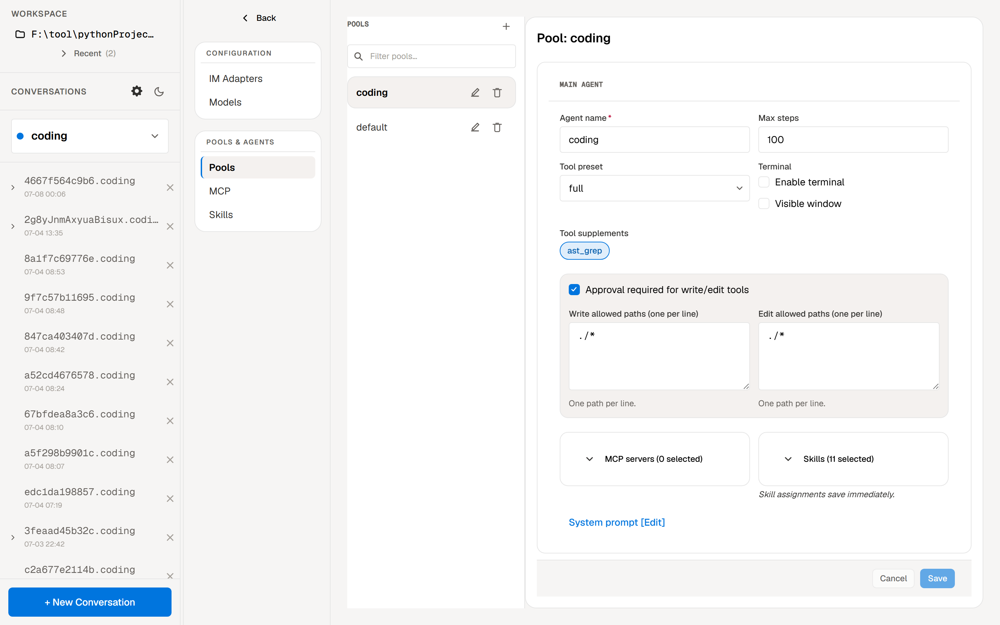
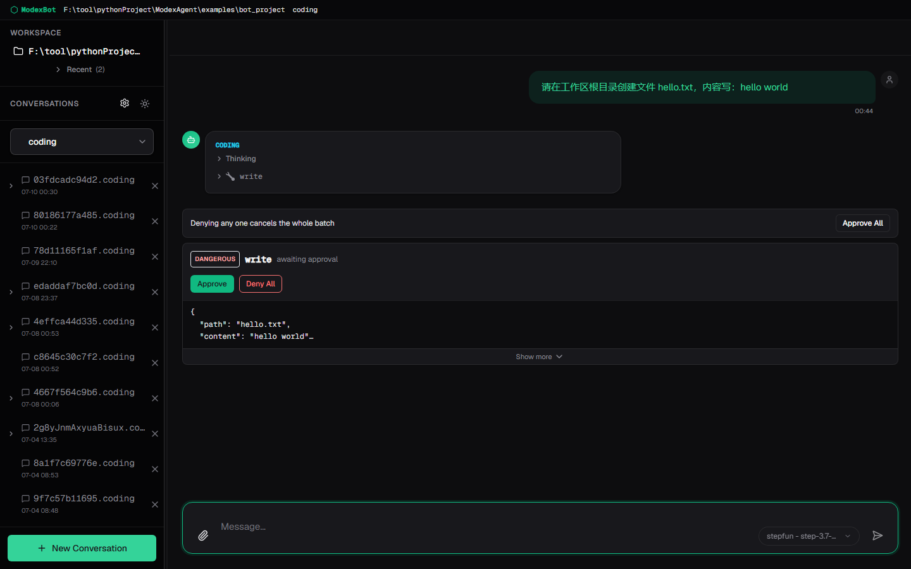
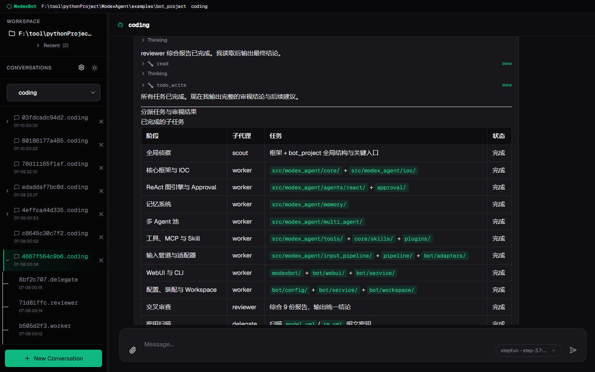

<p align="center">
  
</p>

<p align="center">
  <a href="README.md">English</a> |
  <a href="README.zh-CN.md">简体中文</a>
</p>

<p align="center">
  
  
</p>

<p align="center">
  <strong>模块化、可组合、生产级的 Python Agent 框架</strong>
  <br>
  图驱动 ReAct · 可中断审批 · 跨平台终端 · 多 Agent（池内星型 + 跨池对等）· WebUI
</p>

<p align="center">
  
</p>

ModexAgent 是一个用于构建 AI Agent 应用的 Python 框架。它将模型推理、工具调用、记忆管理、输入输出适配器和多 Agent 协作拆分为可独立演进的模块。你可以从一个最简单的 ReAct Agent 起步，逐步扩展为具备长期记忆、多 Agent 协作、运行时治理和浏览器 WebUI 的完整应用。

框架核心采用**图驱动的执行引擎**替代传统循环，支持执行中途挂起、审批和恢复；运行时采用 **Pool 模式** — 多 Agent 常驻池，通过 `MessageBroker` + `AgentMessageBus` 路由消息，I/O 适配器与 Agent 逻辑完全解耦。`examples/bot_project/` 包含一个完整的 **React + WebSocket WebUI**，支持实时流式渲染和多会话管理。整体设计借鉴了 OpenClaw 的插件化架构思想，同时针对类型安全、跨平台终端交互和 Agent 间通信做了深度定制。

> [!NOTE]
> 项目处于积极开发阶段，核心接口已趋于稳定，`examples/bot_project/` 提供了覆盖框架绝大多数能力的完整示例，包括 WebUI 前端。

## 亮点展示

| 浏览器 WebUI | 可中断审批 | 多 Agent 协作 |
|:---:|:---:|:---:|
|  |  |  |
| 实时流式聊天，内置 TodoPanel 任务面板、每轮模型切换、浏览器内配置编辑器、附件与 Mermaid 图 | 敏感工具调用自动挂起，四级分级策略、级联取消 | 星型拓扑子 Agent，支持同步唤醒、异步 Inbox 和隔离调用；跨池主 Agent 间对等通信 |

## 核心特性

- **图驱动的 ReAct 引擎** — 执行循环以 `Graph[S] + Node[S]` 的泛型图结构建模（由独立的 `modex_graph` 包驱动，ADR-0033），支持 `GraphInterrupt` 挂起与状态持久化恢复，天然适合审批和断点续跑场景。内置循环检测：ReAct 陷入死循环时以受控退出收尾，而不是空烧 token（ADR-0016）。
- **可中断审批** — Agent 在做出有风险的改动前会先征求你的同意。当它试图写或改项目文件夹之外的文件时，会暂停并请求确认——在 WebUI 点一下「批准」，或在聊天里回复 `/approve`，它就从原地继续。默认关闭，可按 Agent 单独开启。
- **跨平台交互式终端** — 内置完整终端工具链，支持 Windows（WinPTY/ConPTY）、Linux/macOS（pexpect/tmux）三端统一接口；支持可见终端窗口与后台 PTY 两种模式，248+ 单元测试覆盖。
- **多 Agent 协作** — 每个 pool 内部是严格星型：主 Agent 作为通信中枢，子 Agent 只能经 `send_to_agent` 与父 Agent 通信（框架按需走 broker、异步 inbox 或隔离 subagent 会话）。跨 pool 时主 Agent 之间是对等的——一个主 Agent 可 `send_to_agent` 另一个 pool 的主 Agent，对方在自己的 bus 上接收并回复。subagent↔subagent、subagent→非父 NORMAL 的发送会被拓扑关卡拒绝。
- **Pool 运行时** — 多 Agent 常驻池，通过 `MessageBroker` + `AgentMessageBus` 路由消息，I/O 适配器与 Agent 逻辑完全解耦。
- **多级记忆 + 自学习系统** — Session、Archive、Core Memory、UserRetentionBuffer、Pruned、Experience 六层记忆，支持 SessionScope / UserScope / GlobalScope 可配置隔离范围。Dream Engine 定期将 Archive 整合为 Core Memory；ExperienceReviewAgent 将对话沉淀为可复用的 EXPERIENCE.md 参考知识。（原 "Knowledge" 层依 ADR-0035 重命名为 "Core Memory"，以与即将推出的 KnowledgeBase（RAG 检索）模块区分。）
- **Hook + Interceptor 扩展体系** — 生命周期 Hook（如 InboxFlush、SubagentAutoSend）与 AOP 拦截器链（ControlDrain、ToolResultLimit）正交组合，框架行为可逐层定制，不侵入核心代码。
- **类型安全** — 全部使用 ABC 接口（零 Protocol），枚举替代原始字符串，`from __future__ import annotations` 全仓覆盖，mypy strict 级别检查。
- **MCP 原生集成** — 动态加载 MCP 服务器（SSE/stdio），`MCPToolAdapter` 自动将 MCP 能力映射为框架 Tool 对象，支持工具、资源、Prompt 三类能力。
- **浏览器 WebUI** — React + Vite 前端，实时流式渲染，内置 **TodoPanel** 任务面板、**每轮模型切换**（多 provider/多模型）、**浏览器内配置编辑器**（Pool/模型/MCP/技能/系统提示，免手改 YAML）、会话树、附件上传下载、Mermaid 图与亮/暗主题（见 `examples/bot_project/`）。

## 架构概览

浏览器 WebUI 经 **WebSocket**（流式聊天、实时状态）与 **REST**（配置编辑、会话/Pool/工作区管理）与 Agent 通信；IM 适配器对称地接入同一套 broker。

```
┌─────────────────────────────────────────────────────────────────────────┐
│              外部平台（QQ / Telegram / CLI / HTTP / WebSocket → WebUI）              │
└─────────────────────────────────────────────────────────────────────────┘
                                    │
                    ┌───────────────┴───────────────┐
                    ▼                               ▼
           ┌─────────────┐                 ┌─────────────┐
           │InputAdapter │                 │OutputAdapter│
           └──────┬──────┘                 └──────▲──────┘
                  │                                  │
                  ▼                                  │
           ┌─────────────────────────────────────────┐
           │           AgentPipeline                 │
           │  ┌─────────┐  ┌─────────┐  ┌─────────┐ │
           │  │Context  │→ │ ReAct   │→ │  Tool   │ │
           │  │Manager  │  │ Agent   │  │Manager  │ │
           │  │(记忆系统)│  │(图引擎) │  │(工具执行)│ │
           │  └─────────┘  └────┬────┘  └─────────┘ │
           │                    │                   │
           │  Hooks / Interceptors / Control / Approval│
           └────────────────────┼─────────────────────┘
                                │
                                ▼
                       ┌─────────────┐
                       │ MessageBroker│
                       └──────┬──────┘
                              │
              ┌───────────────┼───────────────┐
              ▼               ▼               ▼
        ┌─────────┐    ┌─────────┐    ┌─────────┐
        │AgentPool│    │Subagent │    │ Inbox   │
        │(常驻Agent)│   │Manager  │    │Server   │
        └─────────┘    └─────────┘    └─────────┘
```

## 快速开始

### Windows — 安装包（推荐）

从 [Releases](https://github.com/moyu-er/ModexAgent/releases/latest) 页面下载安装包，双击即可安装。安装包已内置完整的 Python 运行环境和所有依赖，**无需预装任何开发工具，安装过程也不需要联网**。

1. **下载** — 打开 [Releases](https://github.com/moyu-er/ModexAgent/releases/latest) 页面，下载 `ModexBot-Setup-x.x.x.exe`
2. **安装** — 双击运行，按提示完成安装（无需管理员权限）
3. **启动** — 双击桌面上的「ModexBot」图标，或在开始菜单中找到 ModexBot
4. **配置模型** — 首次启动后，在 WebUI 的「设置」页面填入模型 API Key（支持 DeepSeek、OpenAI 等）

WebUI 会自动打开，开始对话吧！

<details>
<summary>命令行操作</summary>

安装后可在任意终端使用 `modexbot` 命令：

| 命令 | 作用 |
|------|------|
| `modexbot start` | 启动 |
| `modexbot stop` | 停止 |
| `modexbot restart` | 重启 |
| `modexbot logs -f` | 查看实时日志 |
| `modexbot config` | 配置向导 |
| `modexbot model` | 模型设置 |

通过「添加或删除程序」卸载。你的配置文件（含 API Key）会保留，方便下次重装。

</details>

### macOS / Linux / 开发者 — 从源码运行

macOS/Linux 暂无安装包，可从源码运行：

```bash
git clone https://github.com/moyu-er/ModexAgent.git
cd ModexAgent/examples/bot_project

# Windows
install.bat

# Linux / macOS
chmod +x install.sh && ./install.sh
```

脚本会自动安装缺失的 `uv` + Node.js，配置 Python 环境，编译 WebUI 前端，并将 `modexbot` 注册到系统 PATH。然后：

```bash
modexbot start   # 打开 http://localhost:21800/webui/
```

详细步骤和故障排除见 **[docs/bot-local-setup.md](docs/bot-local-setup.md)**。

## 项目结构

```
ModexAgent/
├── src/modex_agent/   # 框架包——ABC、运行时、记忆、多 Agent、工具、WebUI 接入
├── examples/
│   └── bot_project/   # 参考应用：WebUI + IM 适配器（QQ、Telegram）—— Pool 模式
├── tests/             # 单元、架构、一致性、集成测试
└── docs/              # ADR、设计文档、Agent 文档
```

`src/modex_agent/` 是可复用框架；`examples/bot_project/` 是基于它构建的端到端应用。各模块的 `AGENTS.md` 文件有详细说明。

## 文档

| 文档 | 说明 |
| --- | --- |
| [ADR 索引](docs/adr/) | 架构决策记录（ADR-0001 ~ 0035） |
| [文档总览](docs/AGENTS.md) | `docs/` 目录索引——ADR、设计文档、Agent 文档 |
| [CONTEXT.md](CONTEXT.md) | 领域术语表——Pool、Workspace、ReAct Agent、Graph、GraphInterrupt、Assembly 等 |
| [本地环境搭建](docs/bot-local-setup.md) | 从源码搭建 bot 的详细步骤（前置依赖、venv、配置向导、故障排除） |
| [Bot 示例](examples/bot_project/README.md) | bot_project 详解（多通道 IM + WebUI、多 Agent 配置） |
| [外部编码 Agent](docs/design/external-agent-integration/spec.md) | 将 OpenCode 等编码 Agent CLI 接入为 pool 主 Agent（ADR-0022） |
| 各模块 `AGENTS.md` | `src/modex_agent/` 下每个包都附带 `AGENTS.md`，描述其职责与关键文件 |

## 开发命令

```bash
pytest tests/unit/ -v
pytest tests/integration/ -v -m integration

ruff check src/modex_agent tests
ruff format src/modex_agent
mypy src/modex_agent
```
