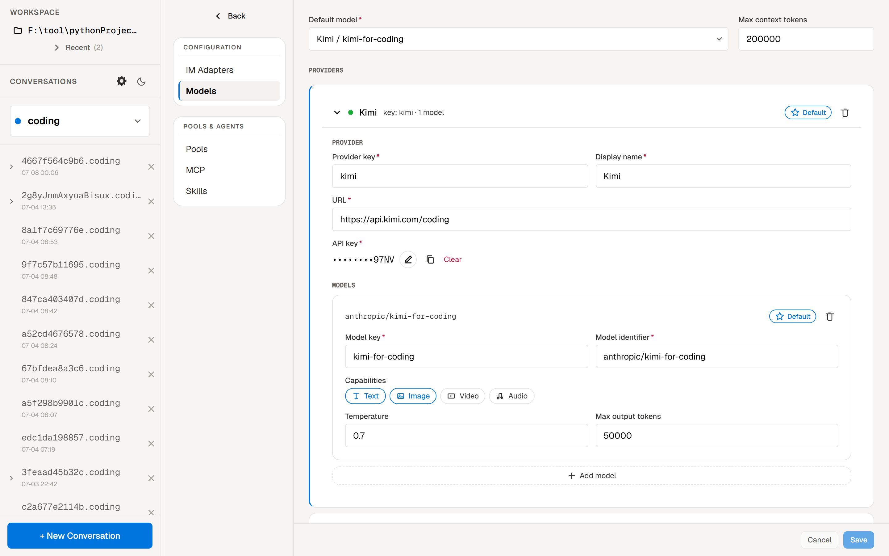
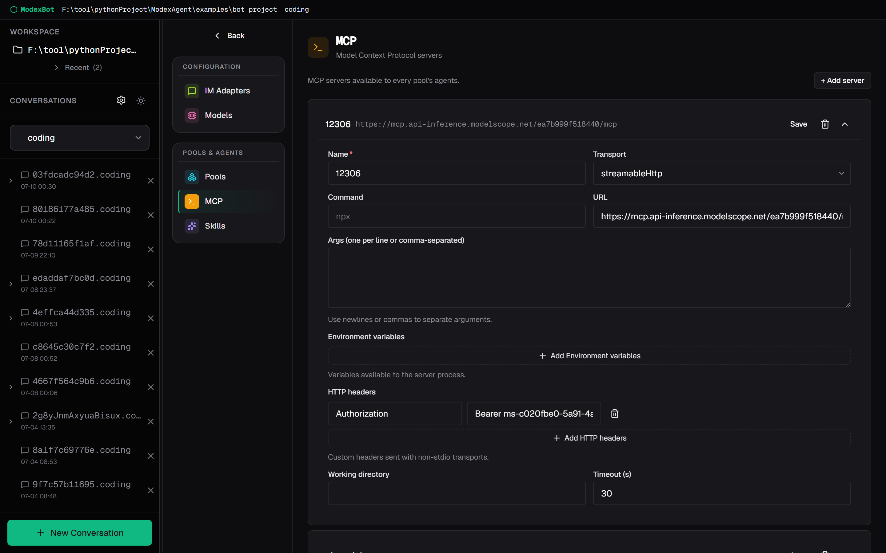
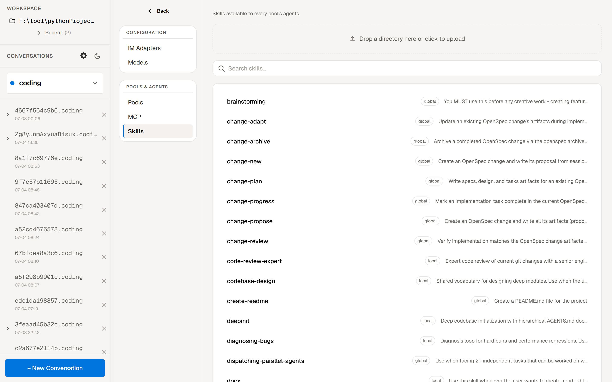

<p align="center">
  
</p>

<p align="center">
  <strong>ModexAgent Bot 示例 — 带 WebUI 的全栈 Agent 应用</strong>
</p>

<p align="center">
  <a href="README.md">English</a> |
  <a href="README.zh-CN.md">简体中文</a>
</p>

本项目是 ModexAgent 框架的**生产级示例**，展示如何构建一个支持 LLM 对话、工具调用、MCP 集成、多级记忆、多 Agent 协作、自学习经验系统和浏览器 WebUI 的多通道 AI 助手。

采用 **Pool 模式** — 多 Agent 常驻池，通过 `MessageBroker` + `AgentMessageBus` 路由消息，Input/Output 适配器（QQ、Telegram、WebSocket）与 Agent 逻辑完全解耦。

> [!TIP]
> 上手最快的方式是 **WebUI** —— 无需任何 IM 凭证。IM 支持是插件式的：QQ 与 Telegram 开箱即用，新增其他平台（Discord、飞书、钉钉……）只需一个 `register_<name>.py` 模块。**仅使用 WebUI 无需任何 IM 凭证。**

## 能力一览

| 能力 | 说明 |
|------|------|
| **IM 消息收发** | QQ（C2C 私聊 + 群聊，支持附件自动下载）与 Telegram（长轮询，文本 + 单媒体） |
| **WebUI** | 浏览器端聊天，实时流式渲染、多会话侧边栏、工作区浏览器、Pool 选择器 |
| **浏览器内配置** | 在 Settings UI 里改 pool、模型、MCP 服务、技能、系统提示词——免手写 YAML |
| **多模型切换** | `model.yml` 支持多 provider/多模型；在聊天输入框逐轮切换 |
| **TodoPanel** | Agent 自行维护任务列表，面板实时呈现进度，无需主动追问 |
| **附件** | WebUI 上传文件（或 QQ 自动下载）；Agent 感知并可选工具查看/对称下载，带类型/魔数/大小门禁 |
| **富文本渲染** | Markdown、语法高亮代码、Mermaid 图、推理块、流式增量 |
| **会话树** | 按父/子分支展开的会话树 |
| **主题** | 亮/暗 UI 切换 |
| **LLM 对话** | 流式/非流式输出，支持 OpenAI 兼容接口的 100+ 模型 |
| **ReAct 执行** | Thought → Action → Observation 图驱动循环，带循环检测——死循环时受控退出而非空烧 token |
| **工具调用** | 内置文件/Shell 工具 + MCP 动态工具 + 自定义工具 |
| **多级记忆** | Session / Archive / Knowledge / UserRetentionBuffer / Pruned / Experience — 支持 UserScope / GlobalScope / SessionScope 可配置隔离范围 |
| **自学习系统** | ExperienceReviewAgent 将对话沉淀为 EXPERIENCE.md 知识；Dream Engine 定期整合 Archive 为长期记忆 |
| **上下文治理** | ToolChainRepair + Microcompact + TokenBudget 自动优化 |
| **工具审批** | Agent 在改动项目外文件前会先征求同意；WebUI 点按钮或在聊天里 `/approve`。默认关闭，按 Agent 开启 |
| **多 Agent 协作** | 池内星型（主 Agent + subagent，经 `send_to_agent`）+ 跨池主 Agent 间对等通信 |
| **技能系统** | 从 Markdown 文件动态构建系统提示词（`local_skills/` 本地或包内置） |
| **插件系统** | 动态扩展工具、记忆提供者和技能来源 |
| **Slash 指令** | `/approve`、`/deny`、`/continue`、`/cd`、`/pool名称`、`/stop` 及技能触发指令 |
| **Input Pipeline** | 统一消息处理流水线——IM 与 WebUI 共用；阶段「认领或透传」，未知 `/命令` 由唯一终结阶段统一拒绝；IM 10 阶段 / WebUI 8 阶段 |
| **Pool 运行时** | 多 Agent 常驻池，通过 `MessageBroker` + `AgentMessageBus` 路由消息 |
| **自主部署** | Agent 通过 SSH 连接远程服务器，拉取代码并重启自身服务 |

## 架构概览

### WebUI 路径（浏览器 → Agent）

```
浏览器 (React)
    │  WebSocket + REST
    ▼
┌──────────────────────────────────────────────────────┐
│              WebUIServer (aiohttp)                    │
│  /api/sessions, /api/pools, /api/workspace, /ws      │
└────────┬─────────────────────────────────────────────┘
         │  产生 seed UserInputEnvelope
         ▼
┌──────────────────────────────────────────────────────┐
│           Input Pipeline（WebUI，8 阶段）             │
│  SetChannel → ResolveWorkspace → ResolvePool →       │
│  Approval → Skill → Unsupported → Persist → Enqueue  │
└────────┬─────────────────────────────────────────────┘
         │  已解析 session + InputMessage
         ▼
┌──────────────────────────────────────────────────────┐
│              PoolRouter                               │
│         会话 → Pool 分发                              │
└────────┬─────────────────────────────────────────────┘
         │
    ┌────┴─────┬─────────┐
    ▼          ▼         ▼
┌────────┐ ┌────────┐ ┌────────┐
│ main   │ │ coder  │ │  ...   │  ← AgentPool 实例
│  pool  │ │  pool  │ │  pool  │
└────┬───┘ └────┬───┘ └────┬───┘
     │          │          │
     ▼          ▼          ▼
  WebBotEmitter → WebSocket → 浏览器（流式增量渲染）
```

### Pool 模式（IM + WebUI，默认）

适合多 Agent 常驻协作。Input/Output 与 Agent 逻辑完全解耦，通过 Broker 路由消息。

```
QQ 用户 / 群        Telegram 聊天        浏览器 (WebUI)
    │                      │                     │
    ▼                      ▼                     ▼
┌─────────────────┐ ┌─────────────────┐ ┌──────────────────┐
│ QQInputAdapter  │ │ TelegramInput   │ │ WebSocketInput   │
└────────┬────────┘ │    Adapter      │ │    Adapter       │
         │          └────────┬────────┘ └────────┬─────────┘
         │                   │                   │
         ▼                   ▼                   ▼
┌──────────────────────────────────────────────────────┐
│           Input Pipeline（认领 / 透传）              │
│  IM:    SetChannel→ResolveWs→EnvCtrl→SessCtrl→       │
│         ResolvePool→Approval→Skill→Unsupported→      │
│         Persist→Enqueue                              │
│  WebUI: SetChannel→ResolveWs→ResolvePool→Approval→   │
│         Skill→Unsupported→Persist→Enqueue            │
└────────┬─────────────────────────────────────────────┘
         │
         ▼
┌──────────────────────────────────────────────────────┐
│              PoolRouter                              │
│         会话 → Pool 分发                              │
└────────┬─────────────────────────────────────────────┘
         │
         ▼
┌──────────────────────────────────────────────────────┐
│ MessageBroker                                        │
│  ┌─────────┐  ┌─────────┐  ┌─────────────────────┐  │
│  │AgentPool│  │Subagent │  │  BrokerOutput       │  │
│  │(常驻Agent)│ │Manager  │  │     Adapter         │  │
│  └─────────┘  └─────────┘  └─────────────────────┘  │
│                                                      │
│  ┌───────────────────────────────────────────────┐  │
│  │ AgentMessageBus (InboxProducer/Consumer)      │  │
│  └───────────────────────────────────────────────┘  │
└──────────────────────────────────────────────────────┘
         │
         ├──────────────────┬─────────────────────┐
         ▼                  ▼                     ▼
┌──────────────────┐ ┌──────────────────┐ ┌──────────────────┐
│ QQOutputAdapter  │ │TelegramOutput    │ │ WebBotEmitter    │
│ (QQ 回复)        │ │Adapter           │ │ (WebSocket 增量) │
└──────────────────┘ └──────────────────┘ └──────────────────┘
```

## 快速开始

### 前置条件

只需要 **两个** 运行时 — 其余一切（包括 Python 3.12）均自动管理：

| 运行时 | 用途 | 获取方式 |
|--------|------|---------|
| [**uv**](https://docs.astral.sh/uv/) | Python 包与版本管理器 | 下方安装脚本提供一键安装。手动：`curl -LsSf https://astral.sh/uv/install.sh \| sh` |
| [**Node.js**](https://nodejs.org/) | WebUI 前端构建（仅后端可跳过） | 安装脚本提供自动安装（winget/brew/nvm）。手动：[nodejs.org](https://nodejs.org/) |

> 无需系统 Python、pip 或 npm。`uv` 会自动下载管理 Python 3.12。`node` 自带 `npm`。

### 方式 A：一键安装（推荐）

运行本目录下对应平台的引导脚本：

| 平台 | 脚本 | 运行方式 |
|------|------|---------|
| **Windows** | `install.bat` | 双击运行，或在命令提示符中执行 `install.bat` |
| **Linux / macOS** | `install.sh` | `chmod +x install.sh && ./install.sh` |

两个脚本执行相同的自动化步骤：

| 步骤 | 说明 |
|------|------|
| 环境检查 | 检测 `uv` 和 `Node.js` — 缺失时通过 y/n 提示安装（Windows 用 winget，macOS/Linux 用 brew/nvm） |
| `uv` 安装 | 通过[官方独立安装程序](https://docs.astral.sh/uv/)安装 |
| 虚拟环境 | 在项目根目录创建虚拟环境（`../../.venv`），使用 `uv venv --python 3.12`（Python 由 uv 自动下载） |
| Python 依赖 | 安装完整框架（`..\..\.[all,dev]`）和 bot CLI（`.[webui,dev]`） |
| 环境变量文件 | 如 `.env` 不存在，自动从 `.env.example` 复制 |
| `modexbot install` | 运行配置向导（检查 `config/model.yml`）+ 通过 `npm run build` 编译 WebUI 前端 |
| **PATH 注册** | 提示将 venv 的 `Scripts`/`bin` 目录添加到**系统 PATH**，之后可在任意终端直接使用 `modexbot` — 无需激活 venv |

> [!NOTE]
> 两个脚本都是**幂等的** — 重复运行会自动跳过已完成的步骤。它们缓存 `pyproject.toml` 的哈希值，仅在项目依赖变更时才重新安装 Python 包。缺失前置条件时会触发交互式 y/n 提示。**脚本可在任意目录运行** — 它们通过自身文件路径定位项目。

脚本完成后：

```bash
# 可在任意目录、任意 Shell 中执行 — 无需激活 venv
modexbot start
```

常用命令：`modexbot stop` \| `modexbot logs -f` \| `modexbot install -f` \| `modexbot config`

> [!TIP]
> 如果跳过了 PATH 步骤，仍可通过 venv Python 直接运行：
> - Windows: `..\..\.venv\Scripts\python.exe -m modexbot start`
> - Linux/macOS: `../../.venv/bin/python -m modexbot start`

> [!NOTE]
> **安装损坏自愈**：安装脚本现在会在重装依赖前**先停掉运行中的 bot**，并在安装后做一次完整性导入校验（`import aiohttp._cookie_helpers`）——若校验失败会自动触发干净重装。这能避免 Windows 下"bot 进程占用 aiohttp 文件句柄时重装导致安装残缺"（典型症状：`No module named 'aiohttp._cookie_helpers'`，启动即崩溃）。
> 仍可手动恢复：**先停 bot**（`modexbot stop`），删除项目根的 `.venv` 目录后重新运行 `install.bat` / `install.sh`。
> 跨盘符（uv 缓存在 C:、venv 在其他盘）下，根 `pyproject.toml` 的 `[tool.uv] link-mode = "copy"` 已强制 uv 用复制而非硬链接，从源头规避解压不完整。

---

---

### 方式 B：手动配置

#### 1. 安装依赖

先安装 `uv` 和 `Node.js`（如尚未安装），然后：

```bash
cd /path/to/ModexAgent

# 创建虚拟环境（uv 会自动下载 Python 3.12）
uv venv --python 3.12

# Windows
.venv\Scripts\activate

# macOS / Linux
source .venv/bin/activate

# 安装框架
uv pip install -e ".[all,dev]"

# 安装 bot 项目（注册 'modexbot' CLI）
cd examples\bot_project
uv pip install -e ".[webui,dev]"
```

> [!IMPORTANT]
> `terminal` extra 是交互式 Shell 工具必需的。Windows 上安装 `pywinpty`；Linux/macOS 上安装 `pexpect` 和 `libtmux`。

#### 2. 配置环境变量

```bash
cd examples/bot_project
cp .env.example .env
# 编辑 .env 填写真实值
```

`.env` 关键字段：

```env
# 时间戳时区
TIMEZONE=Asia/Shanghai

# MCP 服务凭证
MCP_BEARER_TOKEN=your_modelscope_bearer_token
MINIMAX_MCP_API_KEY=your_minimax_api_key
```

> [!NOTE]
> **IM 凭证不在 `.env` 里。** QQ 与 Telegram 凭证在 `config/im.yml`（每个平台一节）——
> 见「配置参考 → IM 适配器」。模型配置（model / api_key / base URL / capabilities）也**不在**
> `.env` 里，而在 `config/model.yml` —— 见下一步。

#### 3. 配置模型

模型在 `config/model.yml` 中配置（唯一真相源，从 `config/model.example.yml`
复制）。用 `modexbot model` 交互向导，或手动编辑。它存放多个 provider，每个
provider 各自的模型；`default_provider` + `default_model` 是 pool 默认用的，
你也可在 WebUI 里逐轮切换：

```yaml
default_provider: "DeepSeek"
default_model: "deepseek-v4-flash"
max_context_tokens: 200000
providers:
  - key: deepseek
    name: "DeepSeek"
    url: https://api.deepseek.com
    api_key: your_api_key            # 字面值，已 gitignore —— 不是 ${ENV} 引用
    models:
      - name: "deepseek-v4-flash"
        model: openai/deepseek-v4-flash
        capabilities: [text]
        temperature: 0.7
        max_output_tokens: 50000
```

所有 pool 共享这一份模型配置；`config/bot_config.yml` 与
`config/pools/*.yml` **不**携带 `llm:` 段。

#### 4. 运行

**一键启动（推荐）：**

```bash
# 构建 WebUI 前端 + 配置向导，然后启动 bot
modexbot install
modexbot start
```

`install` 命令会检查 `.env` 的 LLM 配置（必要时运行配置向导）并构建 WebUI 前端（`npm run build`）。如果前端已经是最新版本则自动跳过——使用 `-f` 强制重建。`start` 命令以后台脱离子进程启动 bot。

启动后浏览器访问 `http://localhost:21800/webui/`。

停止 bot：

```bash
modexbot stop
```

**手动启动（调试用）：**

```bash
# Pool 模式（多 Agent 协作 + WebUI）— 前台运行
python -m modexbot _run

# 或使用调试入口（写入 PID，'modexbot stop' 仍可生效）
python debug_main.py
```

## 核心特性详解

### WebUI

内置 React 前端（Geist 风格、暖色暗色调）是使用 bot 最快的方式——无需任何 IM 凭证。`modexbot start` 后打开 `http://localhost:21800/webui/`。

- **实时流式渲染** — Agent 输出增量展示，带打字机动画效果
- **多会话侧边栏 + 会话树** — 可切换不同会话，每个会话完全隔离，并按父/子分支展开
- **工作区浏览器** — 在 UI 中浏览和切换项目目录
- **Pool 选择器** — 选择用哪个 Agent Pool 处理新会话
- **历史回放** — 过往会话从 transcript store 加载回显

#### 浏览器内配置

在 Settings UI 里改一切——免手写 YAML、免重启折腾（需要重启的改动会提示你）：

| 标签页 | 可编辑内容 |
|--------|------------|
| **Pools** | 新建/重命名 pool、加 subagent、选工具 preset、开关审批、改系统提示词 |
| **Models** | provider 与模型（`default_provider` / `default_model` + 每个 provider 的模型列表）|
| **MCP** | 新增/重命名/删除 MCP 服务、管理密钥 |
| **Skills** | 浏览所有技能及其来源（`local_skills/` 本地 vs 打包内置）|








#### 每轮模型切换

在聊天输入框的模型选择器里，每条消息前选 provider + 模型。模型在 `model.yml` 里统一定义、跨 pool 共享。

#### TodoPanel

当 Agent 把工作拆成步骤时，侧边任务面板会实时跟踪任务列表——你能看到进度、及时察觉它跑偏，而不必主动追问。

#### 富文本渲染

Markdown、语法高亮代码、**Mermaid 图**、推理块都内联渲染。

#### 主题

侧边栏可切换亮/暗主题。

### Input Pipeline（统一消息处理流水线）

所有用户消息——来自 IM（QQ、Telegram）和 WebUI——在到达 Agent 之前经过共享流水线。阶段遵循**认领或透传**：识别该输入的阶段负责处理（控制指令直接终结，技能/审批认领后继续），不识别的阶段原样放行；唯一的终结阶段 `UnsupportedCommand` 拒绝任何无人认领的 `/命令` 并给出统一提示——命令识别与拒绝集中在一处，不再散落各阶段。IM 流水线 10 阶段，WebUI 8 阶段（无环境/会话控制，浏览器有等价 GUI），顺序如下：

| 阶段 | IM | WebUI | 功能 |
|------|:--:|:-----:|------|
| SetChannel | ✅ | ✅ | 标记会话来源通道（最先运行，使提示回到正确通道适配器） |
| ResolveWorkspace | ✅ | ✅ | 解析并锚定当前活跃 workspace 根 |
| EnvironmentControl | ✅ | — | `/cd`、`/pool`、`/exit`、`/pwd` |
| SessionControl | ✅ | — | `/stop` 取消当前轮次 |
| ResolvePool | ✅ | ✅ | 解析 Pool + Agent，持久化 session→pool |
| Approval | ✅ | ✅ | 认领 `/approve`·`/deny`，转成结构化审批决策 |
| SkillParse | ✅ | ✅ | 校验 `/skillName`，转换为 XML；未知则透传 |
| UnsupportedCommand | ✅ | ✅ | 终结阶段：拒绝任何无人认领的 `/命令`，统一提示 |
| PersistUserMessage | ✅ | ✅ | 写入 transcript store（唯一持久化路径） |
| Enqueue | ✅ | ✅ | 构建 InputMessage，入队到 Agent |

### 多级记忆系统

```
┌───────────┐  ┌───────────┐  ┌───────────┐  ┌───────────┐  ┌───────────┐  ┌───────────┐
│ Session   │  │  Archive  │  │ Knowledge │  │UserRetention│ │  Pruned   │  │Experience │
│ 短期会话  │→ │ 历史归档  │→ │ SOUL.md   │  │  Buffer    │  │ 淘汰目录  │  │EXPERIENCE │
│ (自动清理)│  │ (压缩存储) │  │ USER.md   │  │ (防过度压缩)│  │ (注入参考) │  │.md 文件   │
└───────────┘  └───────────┘  └───────────┘  └───────────┘  └───────────┘  └───────────┘
```

- **Session**：当前会话近期对话历史，超限后自动清理
- **Archive**：压缩后的历史归档，同一用户跨会话共享
- **Knowledge**：长期知识文件（SOUL.md / USER.md / MEMORY.md）
- **UserRetentionBuffer**：额外保留缓冲，防止治理压缩过度丢失关键上下文
- **Pruned**：淘汰消息的目录索引，按会话存储用于注入
- **Experience**：从历史对话中自学习提取的可复用参考知识（EXPERIENCE.md）
- **Dream Engine**：离线定期将 Archive 整合为 Knowledge
- **ExperienceReviewAgent**：分析对话并创建/更新 EXPERIENCE.md 文件
- **可配置范围**：SessionScope / UserScope / GlobalScope — Archive 和 Knowledge 可按用户隔离或全局共享

### 自学习系统（Experience）

Bot 会从每次对话中学习：

1. 对话结束后，`ExperienceReviewAgent` 分析交互内容
2. 提取可复用的模式、解决方案和知识点
3. 在 experience 目录创建或更新 `EXPERIENCE.md` 文件
4. 后续对话中，相关经验自动注入系统提示词
5. Experience 支持 scope 隔离 — UserScope 按用户隔离，GlobalScope 全局共享

### 工具审批

Agent 在做出可能有风险的改动前，会先征求你的同意。它盯住文件的写/改操作：**项目文件夹内**的改动直接放行，但写到**项目之外**（或敏感位置）时会暂停并弹出审批提示——WebUI 里是一张卡片，聊天里是一条消息。批准则继续、拒绝则停下，Agent 从原地精确恢复。

审批**默认关闭**。在 pool 配置里给某个主 Agent 开启：

```yaml
approval:
  enabled: true
  tools:
    write_file: { allowed_paths: ["./*"] }   # 项目内自动放行，其余先问
    edit_file:  { allowed_paths: ["./*"] }
```

`config/pools/default/pool.yml`、`config/pools/coder/pool.yml` 里有现成示例。聊天里回复 `/approve` 或 `/deny`；WebUI 里点审批卡片上的按钮。（审批不作用于 subagent。）


### 多 Agent 协作

主 Agent 把任务派给专门的子 Agent，再回收它们的回复。它会自动挑合适的子 Agent 接活，而整段对话——连同子 Agent 的工作过程——都在一处可见。子 Agent 之间不直接对话，所有信息都经主 Agent 中转，脉络清晰。


### 自主部署

Agent 通过 SSH 连接远程服务器，执行 `git pull` 并重启自身服务 —— 展示了深度交互式终端能力：


### 附件

文件对称地进出，且 Agent 感知到它们（ADR-0013）：

- **WebUI 上传** — 在输入框附加文件；Agent 看得到，可选工具读取/查看，你也能下载回来。
- **QQ 自动下载** — IM 里的图片/文件附件自动抓取。
- **安全门禁** — 类型 + 魔数 + 大小三重校验（默认图片 ≤ 20 MB、其他文件 ≤ 10 MB，前后端可配），带每会话存储预算（超额淘汰最旧）与出站上限。

### 技能系统

技能从 Markdown 文件（可带 YAML frontmatter `description`）自动发现并注入系统提示词。每个技能带一个**来源**标记——`local`（你的 `local_skills/` 目录，可编辑）或 `bundled`（由包/插件提供）：

```
skills/                     # 每 pool 的技能（自动发现）
├── main/                   # 主 Agent 技能
│   ├── weather/SKILL.md
│   └── github/SKILL.md
└── subagents/              # Subagent 技能（按 agent name 自动发现）
    ├── office-expert/
    └── query-12306/

local_skills/               # 项目级本地技能（来源：local）
└── huashu-design/SKILL.md
```

WebUI 的 **Skills** 标签页列出每个技能及其来源。

### Slash 指令

指令在到达 Agent 前由 Input Pipeline 解析——`EnvironmentControl`/`SessionControl` 认领 IM 控制指令，`Approval` 认领 `/approve`·`/deny`，`SkillParse` 认领 `/skillName`，终结的 `UnsupportedCommand` 阶段拒绝其余未认领指令：

| 指令 | 说明 |
|------|------|
| `/approve` | 批准待审批的工具调用 |
| `/deny` | 拒绝待审批的工具调用 |
| `/continue` | 继续对话，不将指令本身加入上下文 |
| `/cd <路径>` | 切换工作目录（仅 IM） |
| `/pool名称` | 切换到指定 Agent Pool（仅 IM） |
| `/stop` | 取消当前运行中的轮次（仅 IM） |
| `/weather 上海明天天气` | 技能指令，自动注入对应 SKILL.md |

### 治理系统

治理在每次调用 LLM 之前作用于模型可见的消息副本。在 Pool 配置或 Subagent 模板的 `memory.governance` 下配置。

主 Agent 示例（`config/pools/default/pool.yml`）：

```yaml
memory:
  session:
    max_messages: 150
    max_context_tokens: 100000
  governance:
    tool_chain_repair: true      # 必需：修复孤儿/不完整 tool-call 组
    lossy_compaction:
      tool_result_head_chars: 1200
      assistant_head_chars: 1200
      agent_head_chars: 2000
      user_head_chars: 4000
      compact_range_count: 50    # 可选：默认 50，最小 20
```

Subagent 模板（`config/pools/*/templates/*.yml`）保持轻量治理：

```yaml
memory:
  session:
    max_messages: 100
  governance:
    tool_chain_repair: true
```

## Pool 与 Workspace

### Pool

一个 **pool** 是一套自包含的 Agent 部署：一个**主 Agent** 加零到多个 **subagent**，以星型拓扑协作（subagent 只与主 Agent 对话，彼此不直接通信）。各 pool 互相隔离——各自带自己的 agent、系统提示词、工具、记忆与会话。不同 pool 的主 Agent 之间可通过 `send_to_agent` 对等通信（跨池消息），因此一个 pool 里的任务可以请另一个 pool 里的专家帮忙。

在磁盘上，pool 就是 `config/pools/` 下的一个目录——**目录名即 pool 标识**：

```
config/pools/
├── default/                # pool 名 = 目录名
│   ├── pool.yml            # 主 Agent 配置（max_steps、工具、审批 ……）
│   └── templates/          # subagent 模板——每个一个 .yml
│       └── office-expert.yml
└── coder/
    ├── pool.yml
    └── templates/          # 本 pool 的 subagent
```

- **主 Agent 名**默认就是目录名（可用 `pool.yml` 里的 `main_agent_name` 覆盖）。
- **Subagent** 是 `templates/*.yml`，自动注册——主 Agent 通过 `send_to_agent` 把活派给它们。
- 在 WebUI 的 pool 选择器（或 IM 里 `/pool_name`）选哪个 pool 处理当前会话。

内置的 `default` 与 `coder` 两个 pool 是示例——可直接用、可查看、也可替换成你自己的。

### Workspace

一个 **workspace** 是 pool 当前的工作目录——文件工具、终端、per-pool 资源都锚定在它上面。多个 workspace 可同时活跃、按 pool 隔离；在 WebUI 工作区浏览器（或 IM 里 `/cd <path>`）切换当前 workspace。Pool 与 workspace 正交：任意 pool 可在任意 workspace 运行。

## 自定义 Pool 与 Agent

最快的方式是 **WebUI → Settings → Pools** 标签页：新建/重命名 pool、加 subagent、选工具 preset、开关审批、改系统提示词——应用后按提示重启即可。你在 UI 里的所有改动，都持久化到你可以手改的同一份 `config/pools/<name>/pool.yml` + `templates/*.yml`。

### 工具 preset

一个 subagent 的工具集由一个 **preset**（允许它做什么）概括：

| Preset | 读 | 写 | 编辑 | 列目录 | 搜索 | 查找 | Bash | 终端 |
|--------|:--:|:--:|:----:|:------:|:----:|:----:|:----:|:----:|
| `full` | ✅ | ✅ | ✅ | ✅ | ✅ | ✅ | ✅ | ✅* |
| `read_write` | ✅ | ✅ | ✅ | ✅ | ✅ | ✅ | ✅ | — |
| `read_only` | ✅ | — | — | ✅ | ✅ | ✅ | ✅ | — |
| `minimal` | ✅ | ✅ | — | ✅ | ✅ | — | — | — |

`*` 终端工具需 `use_terminal: true`。subagent 的 bash 一律走 `SubprocessTool`（无状态）。

### 手动（YAML）

subagent 模板 `config/pools/<pool>/templates/my-agent.yml`：

```yaml
name: "my-agent"
max_steps: 60
tool_preset: read_write        # read_only / read_write / full / minimal
extra_tools: []                # 可选：preset 之外再加的工具名
system_prompt: |
  你是一个...的 Agent。
  完成后通过 send_to_agent 把结果回复给主 Agent（target_agent="main")。
skills:
  roots:
    - "skills/subagents/my-agent"
```

重启服务（或在 WebUI 保存），agent 自动注册——主 Agent 即可把活派给它。

## 适配其他 IM 平台

`BotService` 是通用基类，不绑定任何平台。QQ 与 Telegram 是内置的两个适配器，二者遵循完全相同的即插即用模式——因此新增一个平台（Discord、飞书、钉钉……）就是同样的流程：

1. 创建 `bot/adapters/<platform>.py`，包含三个类：
   - `<Platform>InputAdapter` —— 继承 `InputAdapter`，接收消息并产生 seed `UserInputEnvelope` 供 Input Pipeline 处理。
   - `<Platform>OutputAdapter` —— 继承 `OutputAdapter`，把回复发回该平台。
   - `<Platform>Emitter` —— 继承 `StreamingAwareEmitter` 或 `ContentEmitter`，把 agent 事件转换为平台消息。
   - 仅当 pipeline 由外部持有时才重写 `configure_input_pipeline()`（参见 `WebSocketInputAdapter`）；否则继承 ABC 默认实现即可。

2. 创建 `bot/adapters/register_<platform>.py`，用 `@register` 装饰构建函数：

```python
from bot.adapters.channels import AdapterBuildContext, register

@register("discord", enabled=True)
def build_discord(ctx: AdapterBuildContext):
    from bot.adapters.discord import DiscordInputAdapter, DiscordOutputAdapter, DiscordEmitter

    cfg = ctx.raw_config.get("discord", {})
    if not cfg.get("enabled"):
        return None  # 未配置时跳过

    discord_input = DiscordInputAdapter(...)
    discord_output = DiscordOutputAdapter(discord_input)

    def emitter_factory(session_id: str):
        return DiscordEmitter(
            output_adapter=discord_output,
            session_id=session_id,
            config=...,
        )

    return discord_input, discord_output, emitter_factory
```

3. （可选）在 `bot/config/domains/im.py` 里用 `register_kind` 声明该平台的类型化配置段，并在 `config/im.yml` 加对应一节。

4. 重启服务。`WebUIService` 会自动发现并导入所有 `bot/adapters/register_*.py` 模块，因此**无需修改 `WebUIService`**。

`ChannelRouterOutputAdapter` 会保证一个平台的 slash 命令回复不会串到另一个平台——每个 emitter 按通道过滤，而 WebUI 作为通用观察者，记录所有来源的会话。

```python
from modex_agent import AgentPipeline
from modex_agent.pipeline.adapters import InputAdapter, OutputAdapter


class DiscordInputAdapter(InputAdapter):
    @property
    def name(self): return "discord"

    async def receive(self):
        # 接收 Discord 消息，yield InputMessage(...)
        ...


class DiscordOutputAdapter(OutputAdapter):
    @property
    def name(self): return "discord"

    async def send(self, message, session_id):
        # 发送 Discord 消息
        ...
```

## 配置参考

### IM 适配器

IM 凭证在 `config/im.yml`（已 gitignore——含密钥）。从 `config/im.example.yml` 复制起步。每个平台是顶层一节；适配器只读自己那一节，`enabled: false` 时整体跳过。

```yaml
# QQ —— 从 https://q.qq.com/ 获取 App ID 和 Secret
qq:
  enabled: true
  app_id: "your_qq_app_id"
  secret: "your_qq_secret"
  allow_from:
    - "*"                        # "*" 允许所有人，或列出用户/群 id

# Telegram —— 从 @BotFather 获取 token
telegram:
  enabled: true
  token: "your_telegram_bot_token"
  proxy: null                    # 可选，如 "http://127.0.0.1:7890"
  allow_from:
    - "*"
```

`qq` 与 `telegram` 都在 `bot/config/domains/im.py` 里注册为类型化配置 kind；密钥读取时自动脱敏。新增其他平台见「适配其他 IM 平台」。

### LLM（模型）

模型配置在 `config/model.yml`——唯一真相源（见「快速开始 → 配置模型」）。任何 OpenAI 兼容的 provider 都可用；可配多个 provider、在 WebUI 里逐轮切换。用 `modexbot model` 或 WebUI 的 **Models** 标签页编辑。

### 记忆

```yaml
memory:
  session:
    max_messages: 150
    max_context_tokens: 100000
  governance:
    tool_chain_repair: true
    lossy_compaction:
      tool_result_head_chars: 1200
      assistant_head_chars: 1200
      agent_head_chars: 2000
      user_head_chars: 4000
      compact_range_count: 50
```

### MCP

```json
{
  "mcpServers": {
    "filesystem": {
      "command": "npx",
      "args": ["-y", "@modelcontextprotocol/server-filesystem", "./data"]
    },
    "fetch": {
      "type": "sse",
      "url": "https://mcp.api-inference.modelscope.net/.../sse",
      "headers": {
        "Authorization": "Bearer ${MCP_BEARER_TOKEN}"
      }
    }
  }
}
```

### Subagent 工具

每个 subagent 通过 `tools` 字段独立配置工具集：

```yaml
tools:
  file_tools:
    enabled: true
  shell_tools:
    enabled: true
    timeout: 60
    enable_safety_guard: false
  mcp_tools:
    enabled: true
    server_filter:
      - "12306-mcp"
```

## 插件系统

插件动态扩展工具、记忆提供者和技能来源，无需修改核心代码：

```yaml
plugins:
  enabled: true
  configurations:
    tool_call_cleanup:
      enabled: true                   # 清理冗余的工具调用记录
```

## 日志

日志文件位于 `logs/bot.log`，包含：
- 消息收发记录
- 工具调用记录
- LLM 调用记录
- Agent 间通信记录
- 错误日志

## 相关文档

- [ModexAgent 框架文档](../../README.zh-CN.md)
- [ModexAgent Framework (English)](../../README.md)
- [AGENTS.md](../../AGENTS.md)
