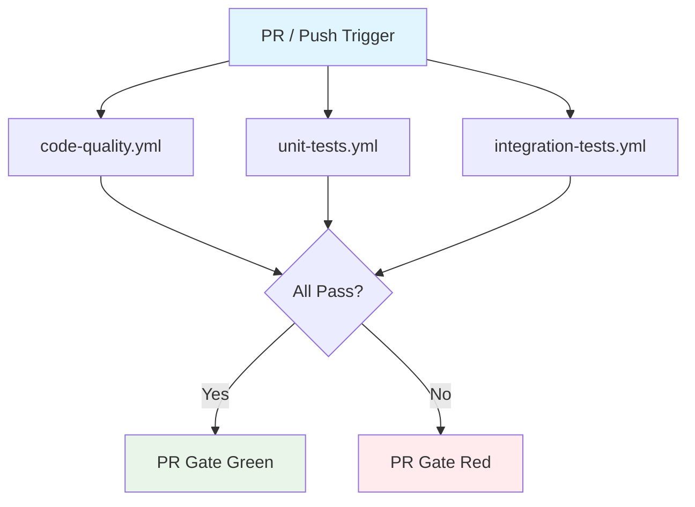

## Workflow Overview

**Purpose**: Gate every PR and push on three independent CI dimensions — code quality, modular unit tests, and integration tests — so failures are isolated by dimension and visible to reviewers.

**Trigger Events**:
- `pull_request` targeting `main`, `develop*`
- `push` to `main`, `develop*`

**Target Environments**: GitHub-hosted `ubuntu-latest` runners, Python 3.12 + 3.13.

## Execution Flow Diagram

## Workflow Files

| File | Dimension | Parallelism | Secret Required |
|------|-----------|-------------|-----------------|
| `code-quality.yml` | Lint + type-check + architecture guards | Python matrix (3.12, 3.13) | No |
| `unit-tests.yml` | Unit tests split by module group | Python × module matrix | No |
| `integration-tests.yml` | E2E integration tests with real LLM | Single (3.13) | Yes (`TEST_LLM_*`) |

Each file is a **standalone workflow** triggered independently. A PR is green only when all three pass. Configure them as **required status checks** in GitHub branch protection settings (Settings → Branches → Branch protection rules → `main` / `develop*` → Require status checks).

---

## Workflow 1: code-quality.yml

### Jobs & Dependencies

| Job Name | Purpose | Dependencies | Execution Context |
|----------|---------|--------------|-------------------|
| ruff | Lint: E, F, W, I, N, UP, B, C4, SIM, ANN | None | ubuntu-latest, py3.12+3.13 |
| mypy | Strict type checking on `src/modex_agent` | None | ubuntu-latest, py3.12+3.13 |
| architecture | Architecture guard tests | None | ubuntu-latest, py3.12+3.13 |

### Quality Gates

| Gate | Criteria | Bypass |
|------|----------|--------|
| ruff | Zero lint errors | Never |
| mypy | Zero type errors on framework code | Never |
| architecture | All guard tests pass | Never |

---

## Workflow 2: unit-tests.yml

### Jobs & Dependencies

| Job Name | Purpose | Dependencies | Execution Context |
|----------|---------|--------------|-------------------|
| framework | `tests/unit/` core framework tests (agents, pipeline, memory, tools, etc.) | None | ubuntu-latest, py3.12+3.13 |
| modex-graph | `tests/unit/modex_graph/` graph engine tests | None | ubuntu-latest, py3.12+3.13 |
| bot-project | `examples/bot_project/tests/` bot-specific tests | None | ubuntu-latest, py3.12+3.13 |
| architecture | `tests/architecture/` architecture invariant tests | None | ubuntu-latest, py3.12+3.13 |
| conformance | `tests/conformance/` store contract tests | None | ubuntu-latest, py3.12+3.13 |

### Module Split Rationale

Splitting by module group lets failures surface in isolation — a modex_graph regression does not re-run 500 framework tests. Each job installs deps once and runs only its test subset.

### Quality Gates

| Gate | Criteria | Bypass |
|------|----------|--------|
| Each module | 0 failures, 0 errors | Never |
| Skipped tests | Reported but not blocking | N/A |

---

## Workflow 3: integration-tests.yml

### Jobs & Dependencies

| Job Name | Purpose | Dependencies | Execution Context |
|----------|---------|--------------|-------------------|
| e2e-graph | E2E graph workflow tests (review loop, memory persistence) | None | ubuntu-latest, py3.13 |

### Secrets & Variables

| Type | Name | Purpose | Scope |
|------|------|---------|-------|
| Secret | `TEST_LLM_API_KEY` | LLM provider API key for E2E | Repository |
| Secret | `TEST_LLM_BASE_URL` | LLM provider base URL | Repository |
| Secret | `TEST_LLM_MODEL` | Model name | Repository |
| Secret | `TEST_LLM_PROVIDER_KEY` | Provider key identifier | Repository |
| Secret | `TEST_LLM_PROVIDER_NAME` | Provider display name | Repository |
| Secret | `TEST_LLM_REASONING_EFFORT` | Reasoning effort level | Repository |
| Variable | `TEST_LLM_TEMPERATURE` | Sampling temperature | Repository |
| Variable | `TEST_LLM_MAX_OUTPUT_TOKENS` | Max output tokens | Repository |

### Skip Logic

When `TEST_LLM_API_KEY` secret is not configured (empty), the conftest fixture calls `pytest.skip()`. The job exits with status `skipped` (not `failed`), so it does not block PRs in repos without E2E credentials.

### Error Handling

| Error Type | Response | Recovery |
|------------|----------|----------|
| LLM timeout | Test fails (120s turn timeout) | Re-run job |
| Network error | Test fails | Re-run job |
| Missing secret | Job skipped | Configure secrets in repo settings |

---

## Execution Constraints

### Runtime Constraints

- **Timeout**: 10 minutes per job (quality), 15 minutes per module (unit), 10 minutes (integration)
- **Concurrency**: Cancel in-progress runs on same branch when new push arrives
- **fail-fast**: `false` — all matrix entries run to completion regardless of sibling failures

### Environmental Constraints

- **Runner**: `ubuntu-latest`
- **Python**: 3.12 (minimum), 3.13 (current)
- **Dependency installer**: `uv` (astral-sh/setup-uv)
- **Network**: Only integration-tests job needs outbound HTTPS to LLM provider

---

## Change Management

### Update Process

1. Modify this specification first
2. Update the workflow YAML files
3. Validate YAML syntax locally
4. Push to a branch and verify CI runs

### Version History

| Version | Date | Changes | Author |
|---------|------|---------|--------|
| 1.0 | 2026-08-08 | Initial specification: 3 workflows replacing single ut.yml | Sisyphus |
